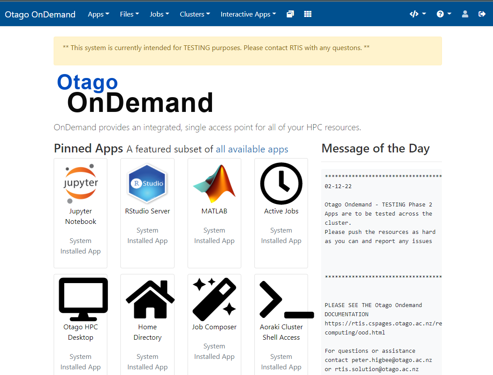
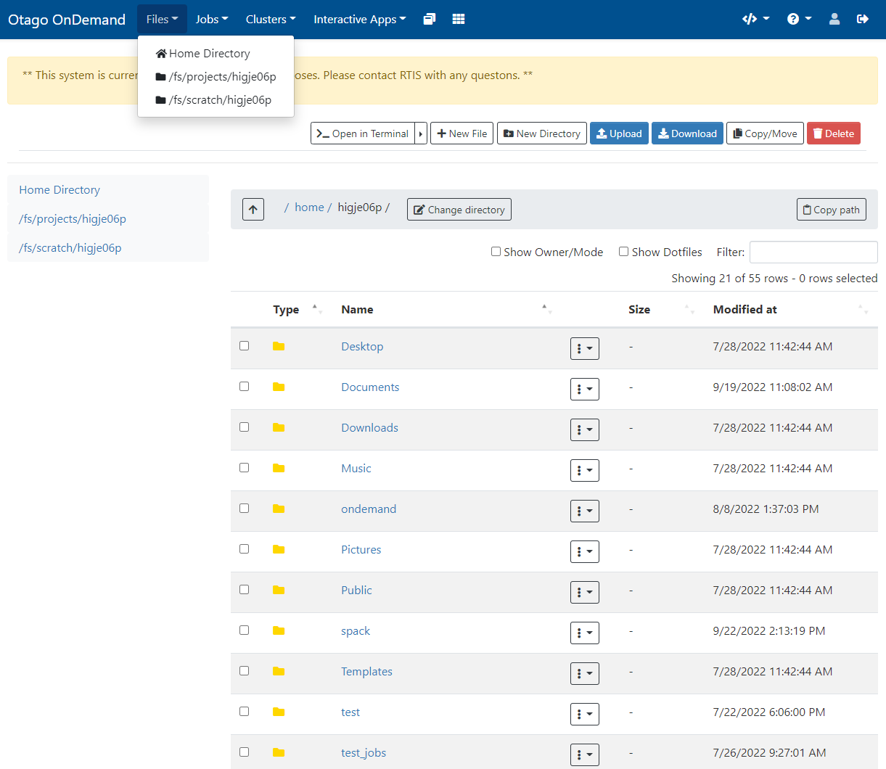
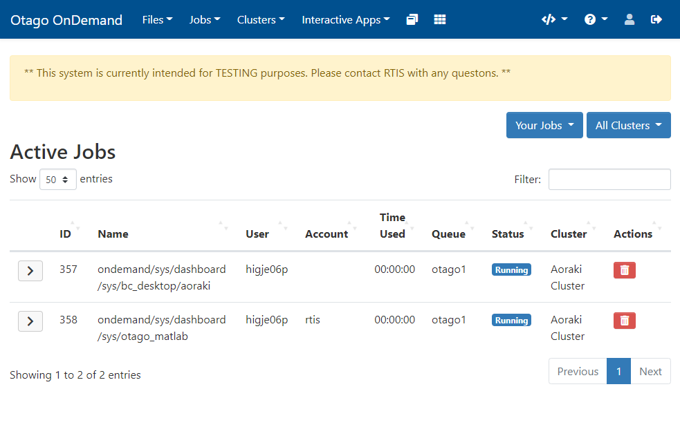
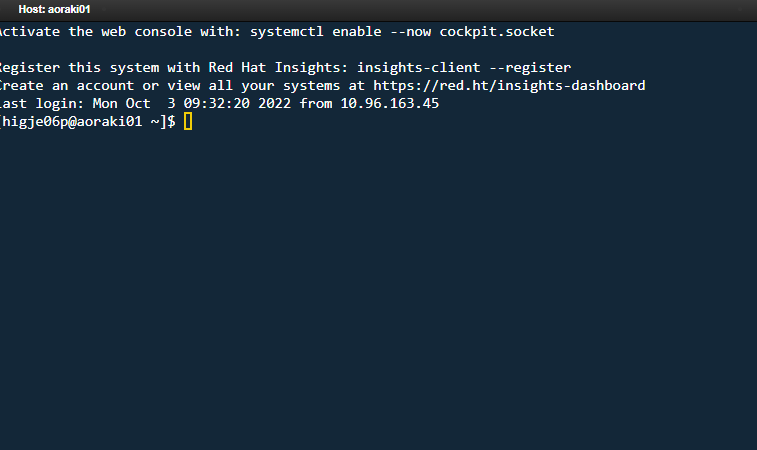
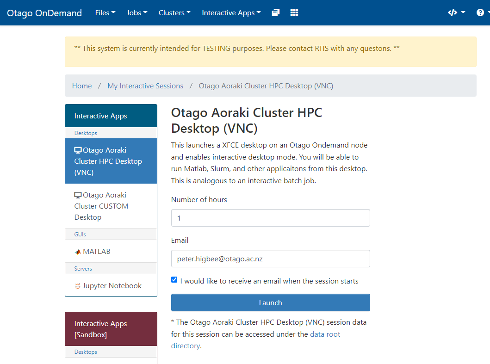
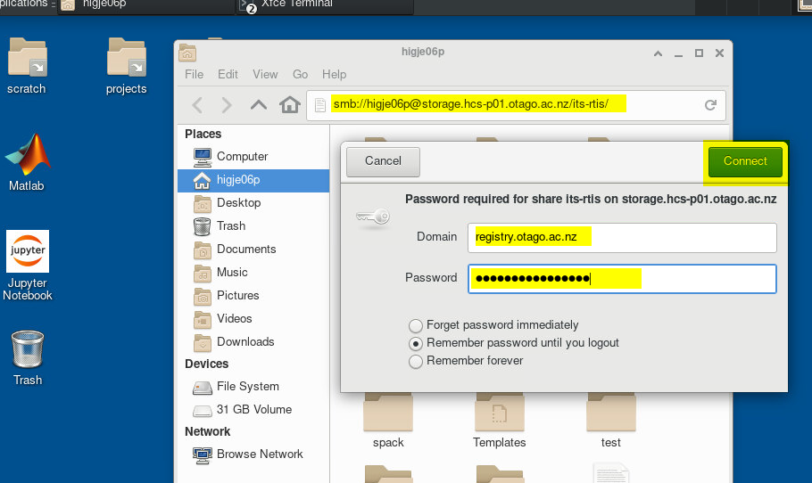
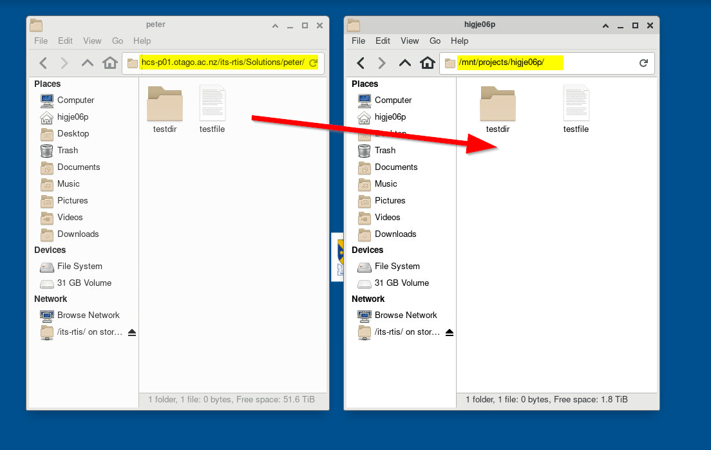

Open OnDemand 
==============
A Webportal for HPC resources

Overview
---------

Open Ondemand is a direct connection to datacentre HPC resources. It provides a web interface for interactive desktop and computing applications, as well as shell access and the ability to orchestrate batch jobs.

**Apps/services include:**
  - Interactive Desktop (that includes access to Matlab, Jupyter Notebook, shell and research file systems)
  - MATLAB
  - Jupyter Notebook
  - RStudio 
  - Slurm job scheduling
  - File system browsing
  - Terminal/shell access to login nodes
  
Logging In
-----------

Visit https://ondemand.otago.ac.nz in your web browser. You must be on the university network, either on campus or via the `University VPN <https://ask.otago.ac.nz/knowledgebase/article/KA-10002113>`_

**Use your Otago username**
  - **Login using your university email addess and password** You will be required to use 2fa if your university account has it enabled. ::

After you login you should see the OOD home page. 

Open OnDemand launches applications as scheduled Slurm jobs on your behalf when requested, right in your browser without installing any software. This load balances your job accross a cluster of computers and allows for shared access with users. 
Open OnDemand refers to these jobs as "interactive sessions." You can also access your files, view past jobs, and get shell access.

Slurm "Job time" is counted for interactive sessions as the total time the job runs. The job starts running as soon as a node is allocated for the job. The interactive session may still be running even if you do not have it open in your web browser. You can view all currently running interactive sessions under My Interactive Sessions. When you are done, you may stop an interactive session by clicking "Delete" on the session.

**There are several ways to monitor usage:**

- Since Open OnDemand submits jobs through Slurm, you can monitor usage as you would monitor your regular Slurm jobs.
- View currently running (and recent) sessions launched by Open OnDemand under My Interactive Sessions.
- View all currently running jobs under Jobs > Active Jobs.

Using Open OnDemand
--------------------
Here are the services provided via Open OnDemand.

Files App
---------
Access the Files App from the top menu bar under Files > Home Directory. Using the Files App, you can use your web browser to:

Create and delete files and directories.
(need to add section on HCS and Globus)
After you login you should see the OOD home page. 

View Active Jobs
-----------------

View and cancel active Slurm jobs from Jobs > Active Jobs. This includes jobs started via sbatch and srun as well as jobs started (implicitly) via Open OnDemand (as discussed above).

Shell Access
-------------
Open OnDemand allows Savio shell access from the top menu bar under Clusters > BRC Shell Access.

Interactive Apps
----------------
Open OnDemand provides additional interactive apps. You can launch interactive apps from the Interactive Apps menu on the top menu bar. The available interactive apps include:

Desktop App (for working with GUI-based programs)
Jupyter Server (for working with Jupyter notebooks)
RStudio Server (for working in RStudio sessions)

Desktop App
--------------
The OOD Desktop App allows you to run programs that require graphical user interfaces (GUIs) on the Otago Aoraki cluster

Intended Usage

When possible, you should carry out your computation via the traditional command line plus SLURM functionality. OOD Desktop is intended for use for programs that require GUIs. Furthermore, if you need to use Jupyter notebooks, RStudio, or the MATLAB GUI, we provide specialized interactive apps that you should use instead of the OOD Desktop App.

Before getting started, make sure you have access to the Aoraki cluster (by contacting RTIS).

Fill out the form presented to you and then press "Launch". (Note, as of this time, that the only partition that the Desktop app can be launched on when computing via Slurm is otago1, as we assume that most GUI usage would be for programs using one or a small number of cores). After a moment, the Desktop session will be initialized and allow you to specify the image compression and quality options. If you are unhappy with the default values, you can relaunch the session from this page with different choices. Then, press "Launch Desktop" and the Desktop will open in a new tab.

Interacting with Files
-----------------------
Your Desktop session is running directly on Aoraki, and can interact with your files either through the command line as usual or through Desktop the file manager.

To open a command line terminal, right click anywhere on the Desktop and select "Open Terminal Here".

Using Otago HCS Data
----------------------
1. Connect to the HCS Share
2. Copy your dats to your projects directory
3. Process your data with the cluster
4. Copy your results back to the HCS Share 

Note: Connecting to Otago HCS is intended for copying data to the Aoraki Clutster for processing. **It is not intended for data processing** as the speeds and accessibility are not suited to cluster computing.

Connecting to Otago HCS Shares
------------------------------

**AutoFS**  

This will autmaticall mount your shard on the local machine and allow you to access files on HCS. Note that this is not high speed access and that you will
need to transfer files to your project director in order to process with applicaitons.  

  1. Take note of your HCS share directory name, the part after //storage.hcs-p01.otago.ac.nz/ **<yourshare>**    
  2. Login to a Desktop or Shell session  
  3. List or navigate to yoru directory /mnt/auto-hcs/*<yourshare>*  
  4. copy your files to your projects directory eg. cp /mnt/auto-hcs/its-rtis/testfile /projects/higje06p/   
  5. use your files to process on the compute cluster   

**SMB Local Mount**  

  1. Start an Otago HPC Desktop  
  2. Login to the Desktop and open File browser window  
  3. Connect and login to HCS by entering the smb://username@storage.hcs-p01.otago.ac.nz/share-name address  
  4. When the authentication window appears (wait 10-20 secs) type in the domain registry.otago.ac.nz and your password  
  5. Press connect and wait a few seconds for authentication and your HCS files to appear in the window.  

Copy your HCS data to your project directory
--------------------------------------------
1. Naviagate to your hcs data and copy it to your user projecy directory

2. When you have finished processing copy your data back to your HCS Share.

